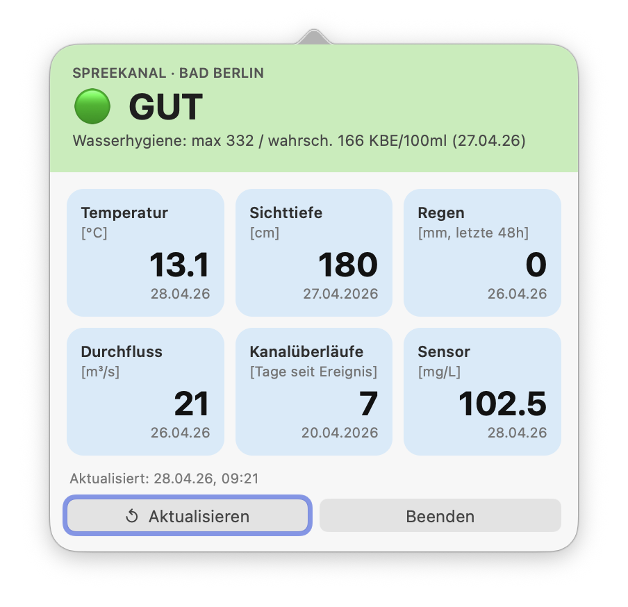

# Bad Berlin – macOS Menüleisten-App

Echtzeit-Wasserqualität des Spreekanals direkt in der macOS Menüleiste, basierend auf den Daten von [panel.badberlin.info](https://panel.badberlin.info/).



## Funktionen

- Wasserqualität auf einen Blick (🟢 Gut · 🟡 Ausreichend · 🟠 Grenzwertig · 🔴 Mangelhaft)
- Pastell-farbiger Header je nach aktuellem Status
- 6 Datenkacheln: Temperatur, Sichttiefe, Regen, Durchfluss, Kanalüberläufe, Sensor
- Automatisches Refresh alle 10 Minuten
- Kein Dock-Icon – lebt ausschließlich in der Menüleiste

## Voraussetzungen

- macOS mit Xcode Command Line Tools (`xcode-select --install`)
- Node.js / npm werden **nicht** benötigt – reines Swift

## Build & Start

```bash
git clone https://github.com/noestreich/BadBerlin.git
cd BadBerlin
bash build.sh
open BadBerlin.app
```

## Autostart

Systemeinstellungen → Allgemein → Anmeldeobjekte → `+` → `BadBerlin.app` auswählen.

## Datenquellen

| Kachel | API-Endpunkt |
|---|---|
| Wasserqualität + Wasserhygiene | `/api/prediction` (E.coli p90/p50, log₁₀) |
| Sichttiefe | `/api/data/depth` |
| Temperatur | `/api/sensor?sourceid=3` |
| Regen (48h) | `/api/data/rain` |
| Durchfluss Spree | `/api/data/flow` |
| Kanalüberläufe | `/api/data/overflow` |
| Qualitätssensor | `/api/sensor?sourceid=2` |
