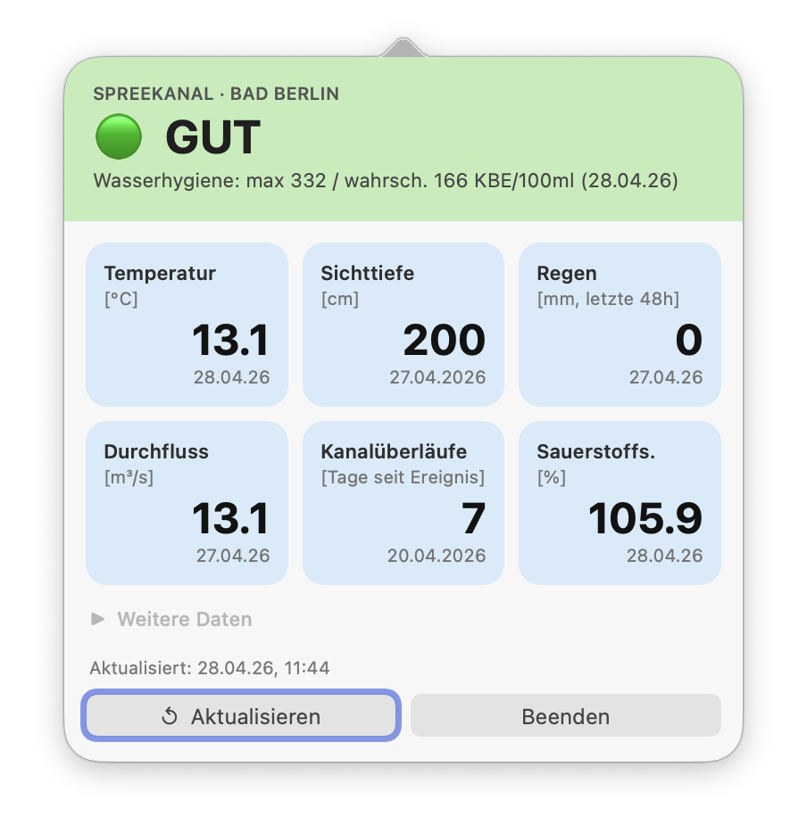
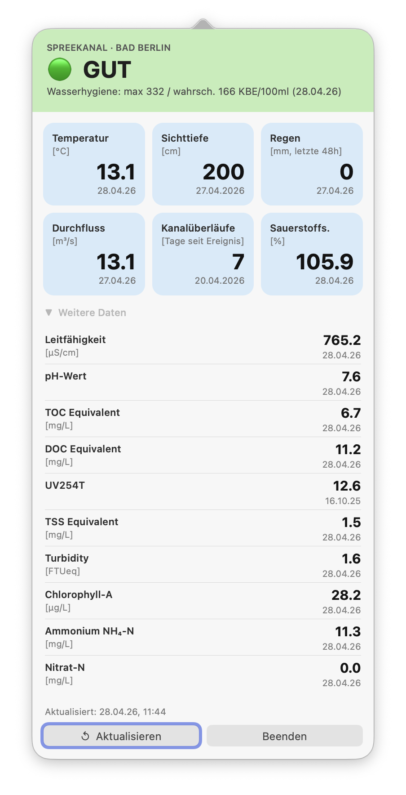

# Bad Berlin – macOS Menüleisten-App

Echtzeit-Wasserqualität des Spreekanals direkt in der macOS Menüleiste, basierend auf den Daten von [panel.badberlin.info](https://panel.badberlin.info/).

| Kompaktansicht | Erweiterte Daten |
|---|---|
|  |  |

## Funktionen

- Wasserqualität auf einen Blick (🟢 Gut · 🟡 Ausreichend · 🟠 Grenzwertig · 🔴 Mangelhaft)
- Pastell-farbiger Header je nach aktuellem Status
- 6 Datenkacheln: Temperatur, Sichttiefe, Regen, Durchfluss, Kanalüberläufe, Sauerstoffsättigung
- Aufklappbarer Bereich mit 10 weiteren Sensorwerten (Leitfähigkeit, pH, TOC/DOC, UV254T, TSS, Turbidity, Chlorophyll-A, Ammonium, Nitrat)
- Automatisches Refresh alle 10 Minuten (alle Werte inkl. erweiterter Sensoren)
- Kein Dock-Icon – lebt ausschließlich in der Menüleiste

## Voraussetzungen

- macOS mit Xcode Command Line Tools (`xcode-select --install`)
- Node.js / npm werden **nicht** benötigt – reines Swift

## Build & Start

```bash
git clone https://github.com/noestreich/BadBerlin.git
cd BadBerlin
bash build.sh
open BadBerlin.app
```

## Autostart

Systemeinstellungen → Allgemein → Anmeldeobjekte → `+` → `BadBerlin.app` auswählen.

## Datenquellen

| Kachel | API-Endpunkt |
|---|---|
| Wasserqualität + Wasserhygiene | `/api/prediction` (E.coli p90/p50, log₁₀) |
| Sichttiefe | `/api/data/depth` |
| Temperatur | `/api/sensor?sourceid=3` |
| Regen (48h) | `/api/data/rain` |
| Durchfluss Spree | `/api/data/flow` |
| Kanalüberläufe | `/api/data/overflow` |
| Sauerstoffsättigung | `/api/sensor?sourceid=2` |
| Leitfähigkeit | `/api/sensor?sourceid=5` |
| pH-Wert | `/api/sensor?sourceid=10` |
| TOC Equivalent | `/api/sensor?sourceid=15` |
| DOC Equivalent | `/api/sensor?sourceid=8` |
| UV254T | `/api/sensor?sourceid=31` |
| TSS Equivalent | `/api/sensor?sourceid=16` |
| Turbidity | `/api/sensor?sourceid=17` |
| Chlorophyll-A | `/api/sensor?sourceid=19` |
| Ammonium NH₄-N | `/api/sensor?sourceid=22` |
| Nitrat-N | `/api/sensor?sourceid=23` |
